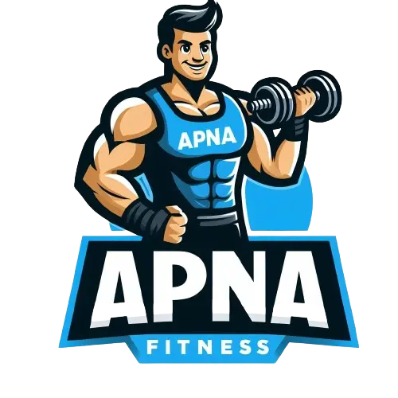

<div id="top"></div>

<!-- PROJECT LOGO -->

<br />
<div align="center">
  <a >
    
  </a>
  <br/>
  <h3 style="font-weight: 600" align="center">APNA FITNESS STORE</h3>

  <p align="center">
    One stop shop for all your Fitness Supplements, Equipments and Accessory needs.
    <br />
    <a href="#">Live Website</a>
    ·
    <a href=https://github.com/PremSingh24/ApnaFitness-E-Commerce/issues/new">Report Bug</a>
    ·
    <a href="https://github.com/PremSingh24/ApnaFitness-E-Commerce/issues/new">Request Feature</a>
  </p>
</div>

<!-- TABLE OF CONTENTS -->

<details style="margin: 1rem 0">
  <summary>Table of Contents</summary>
  <ol>
    <li>
      <a href="#about-the-project">About The Project</a>
    </li>
      <li><a href="#built-with">Built With</a></li>
    <li>
      <a href="#features">Features</a>
    </li>
    <li><a href="#how-to-use">How To Use</a></li>
    <li><a href="#folder-structure">Folder Structure</a></li>
    <li><a href="#contributing">Contributing</a></li>
    <li><a href="#contact">Contact</a></li>
  </ol>
</details>

<!-- ABOUT THE PROJECT -->

## About The Project


Apna Fitness Store is one stop shop for all your Fitness Supplements, Weights, Equipment and Accessory needs. Apna Fitness Store is User Friendly and very easy to use.

<p align="right">(<a href="#top">back to top</a>)</p>

<!-- Built With -->

## Built With

Frontend

- [Next Js](https://nextjs.org/)
- [React JS](https://reactjs.org/)
- [Zustand](https://zustand-demo.pmnd.rs/)
- [axios](https://axios-http.com/docs/intro)
- [Material UI](https://mui.com/material-ui/)
- [Sonner](https://sonner.emilkowal.ski/)

Backend

- [Express Js](https://expressjs.com/)
- [Mongoose](https://mongoosejs.com/)
- [JWT](https://jwt.io/)

Common

- [Turbo Repo](https://turbo.build/)
- [Zod](https://zod.dev/)

<p align="right">(<a href="#top">back to top</a>)</p>

<!-- Features -->

## Features

- User Authentication
  - Login.
  - Signup.
  - Logout.
- Cart Management
  - Add/Remove item to Cart.
  - Increase/Decrease quantity of item in Cart.
  - Move item to Wishlist from Cart.
- Wishlist Management
  - Add/Remove item to Wishlist
  - Move item to Cart from Wishlist
- Filters on Product Listing Page
  - Remove Out Of Stock
  - Price Range
  - Sort Products By Price and Rating
- Payment Integration ([Razorpay API](https://razorpay.com/)).

<p align="right">(<a href="#top">back to top</a>)</p>

<!-- How To Use -->

## How To Use

1.  Visit [Apna Fitness Store]() and click on the Shop Now button, you will be redirected to the Product listing page.

2.  Here you can see some curated Filters, apply your favorite filters and Add your favorite products to the cart.

3.  You can also Search for your favorite products using the Search Feature.

4.  Once Done, navigate to the Cart Management using Cart Icon, inside the Cart Management page you can check all the added products and increase/decrease the number of products.

5.  Finally checkout using the Checkout button and make you payment swiftly and without hassle using Razorpay's Payment Integration.

<p align="right">(<a href="#top">back to top</a>)</p>

<!-- Folder Structure -->

## Folder Structure

```
- /app
   - /Next-client
        - /public
        - /src
            - /app
            - /assets
            - /components
            - /helpers
            - /hooks
            - /services
            - /store
            - /utils
            - next.config.ts
            - package.json
            - tsconfig.json
   - /server
        - /src
            - /controllers
            - /database
            - /middleware
            - /models
            - /routes
            - index.ts
            - nodemon.json
            - package.json
            - package-lock.json
            - tsconfig.json
- /packages
    - /common
        - /schemas
        - /validators
        - index.ts
        - package.json
        - tsconfig.json
    - /eslint-config
    - /typescript-config
- package-lock.json
- package.json
- README.md
- tsconfig.json
- turbo.json
```

<p align="right">(<a href="#top">back to top</a>)</p>

<!-- CONTRIBUTING -->

## Contributing

Contributions are what make the open source community such an amazing place to learn, inspire, and create. Any contributions you make are **greatly appreciated**.

1. Fork the Project
2. Create your Feature Branch
3. Commit your Changes
4. Push to the Branch
5. Open a Pull Request

<p align="right">(<a href="#top">back to top</a>)</p>

<!-- CONTACT -->

## Contact

- Email - [PremSingh.Official29@gmail.com](mailto:premsingh.official29@gmail.com)
- Linkedin - [@PremSingh](https://www.linkedin.com/in/prem-singh29/)

<p align="right">(<a href="#top">back to top</a>)</p>
